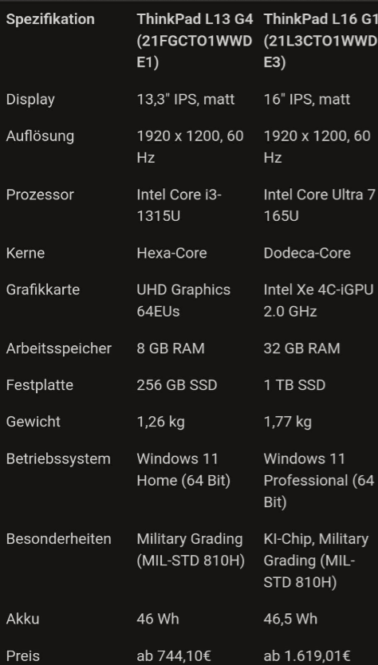

- Präsentation
	- Tische
		- E7 Pro
			- Individuelle Konfiguration
			- Elektrisch höhenverstell bar 63,5-128,5cm
			- anti-Kollision & Speicherfunktion
		- Rodulf
			- Elektrisch Höhenverstellbar 70-117 cm
			- Netz für Kabel unter der Tischplatte
			- Spanplatte ist teilweise recycelt
	- Laptops
		- ThinkPad L16 Gen1
			- Intel Core Ultra 7 vPro
			- 16 Zoll IPS Pannel
			- 32 GB Arbeitsspeicher
			- 1 TB SSD Speicher
		- ThinkPad L13 Gen4
			- Intel Core Ultra i3 13G
			- 14 Zoll IPS Pannel
			- 8GB Arbeitsspeicher
			- 356 GB SSD Speicher
		- 
	- Tastatur
		- MX KEYS S COMBO:
			- Ergonomische Maus und Tastatur
			- Kunststoff besteht aus recyceltem material
			- Bluetooth Gerät belegen keine USB-Ports
		- MK120 CORDED KEYBOARD AND MOUSE COMBO
			- Langlebige Kabelgebundene Maus & Tastatur
			- Bis zu Zehn Millionen Tastatur Anschlägen
	- Headset
		- Jabra Evolve2 65
			- Hohe Akkulaufzeit von 37 stunden
			- Umgebungslautstärke beim Tragen bis zu 50% reduzieren
			- Mikrofon filtert 23% der Hintergrund Geräusche
		- Cherry HC 2.2
			- Kabelgebundenes Headset
			- Ideal für Homeoffice
			- Gute Audio und Mikrofon Qualität
	- Stühle
		- Ergo Line II
			- Ergonomische Rückenlehne
			- Fünffach einstellbare Armlehne
			- Bessert die Sitzposition aus
		- Markus
			- 90% recyceltes Polyester
			- Atmungsaktiver Stoff
			- Standartmäßige Einstellungsmöglichkeiten
	- Docking x Monitore
		- Lenovo ThinkVision T24m-20
			- 23,8 Zoll Full-HD-Display mit 60 hz
			- integrierte Dockingstation
			- klare Konsitene Farben
		- Lenovo ThinkVision E24-30 und i-tec USB 3.0
			- 23,8Zoll Full-HD-Monitor 100hz
			- Dockingstation kann soziemlich jeden anschluss USB-C HDMI und DisplaPort
			- 665,42€
			  id:: 664337db-f8f7-43df-82b6-383df2f10885