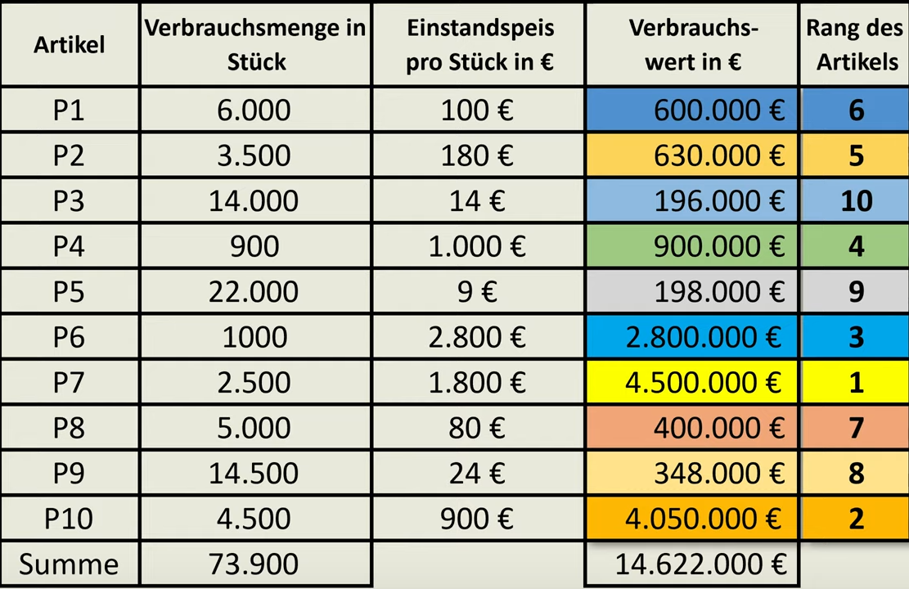

- Bei der ABC-Analyse vergleicht man quasi permanent die werte von Gütern die man im Betrieb brauch und stuft sie in 3 Kategorien ein die alle unterschiedlich viel Anteil am gesamt [Beschaffungsprozess]([[Beschaffungsprozesse]]) aus machen.
	- |Gütergruppe|Wertanteil|
	  |A Güter|75%|
	  |B Güter|20%|
	  |C Güter|5%|
- How to do an ABC-Analyse
	- als erstes muss der verbrauchswert bestimmt werden dafür rechnet man Verbrauchsmenge mal Einstandspreis.
	  Wir können uns also Merken
	   **Verbrauchsmenge** x **Einstandspreis** = **Verbrauchswert**
	  {:height 17, :width 1145}
	- Als Nächstes bestimmt man die Gesamt Verbrauchsmenge und den gesamt verbrauchswert in dem man von beiden alle einzel werte zusammen addier
	  
	- Als nächstes muss man die Reihen folge der Artikel bestimmen, dafür guckt man sich den Verbrauchswert an und nummeriert von Großer zu niedriger zahl alle Artikel "neu", in unserem beispiel hätte Artikel P7 also den Artikel rang 1
	  
	- Nun werden die werte in eine Neue Tabelle mit der neuen Reihenfolge eingefügt. Möchte man die ABC-Analyse Grafisch darstellen muss die nächste Tabelle Verbrauchsmenge und Verbrauchswert wieder spiegeln braucht man keine Graffische Darstellung würde nur der Verbrauchswert reichen
	  
	- Jetzt möchte man die **Verbrauchsmenge in % des Gesamtverbrauches** bestimmen dafür rechnet man:
	  (**Verbrauchsmenge in Stück** x 100)/ **Gesamtverbrauch**     
	  
	- als Nächstes bestimmt man die **Kumulierte Verbrauchsmenge** dafür addiert man die **Verbrauchsmenge in % des Gesamtverbrauches** immer wieder mit dem nächsten teil von sich selbst (wie bei Fibonacci)
	  
- Nun wollen wir den **Verbrauchswert in % des Gesamtverbrauchswertes** das rechnet man so aus wie die **Verbrauchsmenge in % des Gesamtverbrauches** nur mit verbrauchswert und nicht menge heißt:
  (**Verbrauchswert** X 100) / **Gesamtverbrauchswert** 
  
- Den Kumulierten wert bestimmen wir ebenfalls wie bei der **Verbrauchsmenge**
  
- Jetzt bestimmt man welche Güter die A,B und C Güter abbilden, dafür schaut man sich die Kumulierten verbrauchswerte an und wertet aus welche Güter zusammen 75-80% ergeben, welche danach ca 15% ergeben und welche übrig bleiben 
  