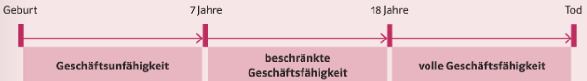

- Man Unterscheidet drei Stufen der Geschäftsfähigkeit:
  [[Geschäftsunfähigkeit]] 
  **Geschäftsunfähig** sind Kinder bis zur Vollendung des siebten Lebensjahres und dauernd geisteskranke Personen
  [[Beschränkt Geschäftsfähigkeit]] 
  **Beschränkt geschäftsfähig** sind Personen, die das siebte, aber noch nicht das achtzehnte Lebensjahr vollendet haben
  [[Unbeschränkte oder volle Geschäftsfähigkeit]]
  **Unbeschränkt oder voll geschäftsfähig** sind Personen mit Vollendung des 18. Lebensjahres, sofern sie nicht zum Personenkreis der Geschäftsunfähigen oder beschränkt Geschäftsfähigen gehören
- 