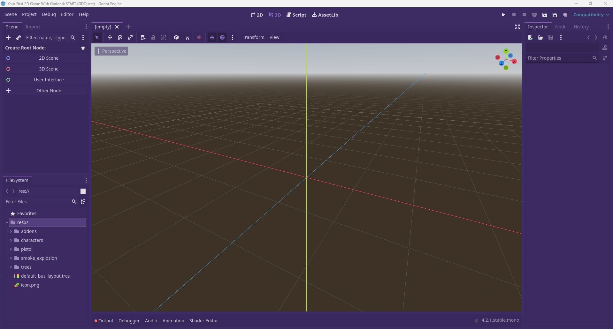
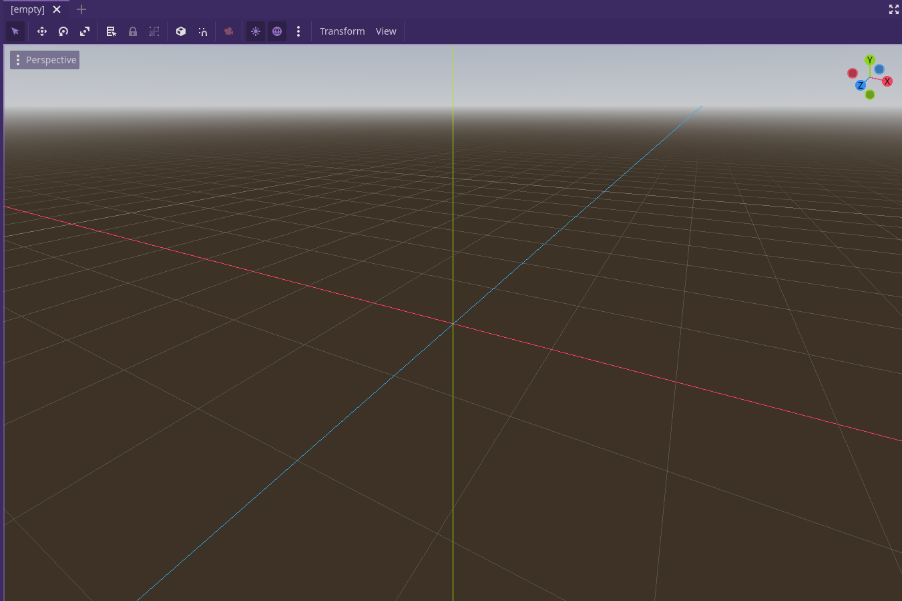
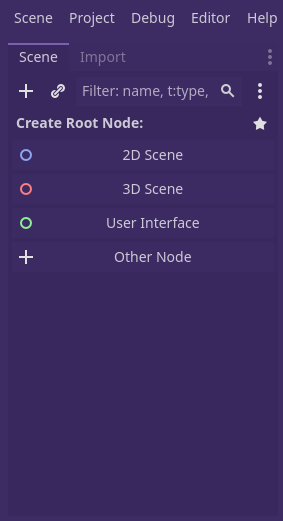
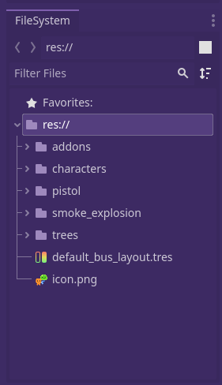
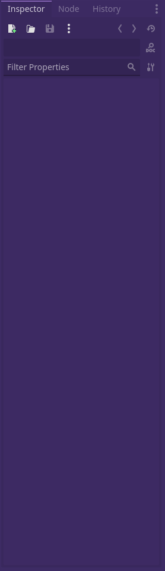

- Wenn man das Godot Projekt startet findet man sich hier:
  
- Dies ist die Szene, hier passt du das an was gesehen wird, die Map, die Position von einem item im Bezug auf ein anderes und vieles mehr kann man hier anpassen. Man kann in der Szene das Prjekt jederzeit in die 3d oder 2d Ansicht ändern empfiehlt sich aber eigentlich nicht.
  
- Hier ist die Fläche mit der man die genutzten Dateien auf einer Szene anpassen kann und neue Nodes hinzufügen kann.
  
-
- Das File System sollte klar sein, aber hier kann man die Dateien Struktur des Projektes anpassen.
  
-
- Mit dem Inspector, kann man das gewählte Item inspizieren und einzelne Daten genau zu verändern.
  