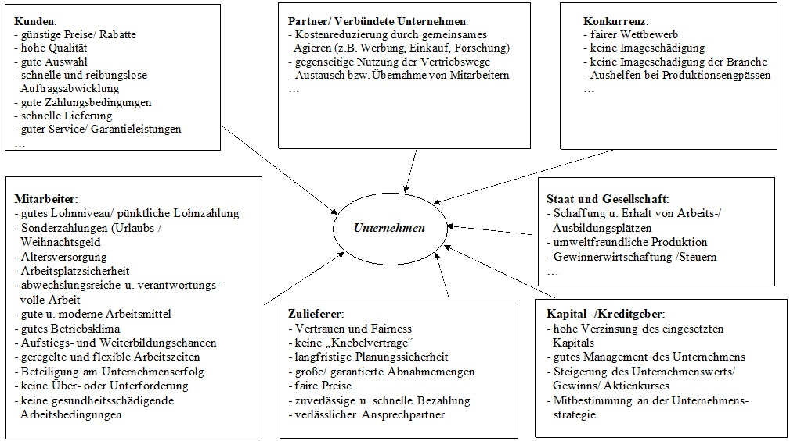

- Steakholder sind alle Personen, die direkt oder indirekt durch die Aktivitäten eines Unternehmens betroffen sind (Auch Anspruchsgruppen => Lieferanten, Mitarbeiter, Kunden & Co).
  Anders als [[Shareholder]] haben nicht alle Stakeholder ein Stimmrecht bei der Hauptversammlung
- Es gibt den [[Stakeholder & Shareholder Value Ansatz]] beim ((6622bdd1-c4af-4086-89c9-522cea3e08da)) wird versucht alle Steakholder gleich zu befriedigen und keine Gruppe explizit zu bevorzugen.
- Bild zu den Anspruchsgruppen und was sie wollen 
  