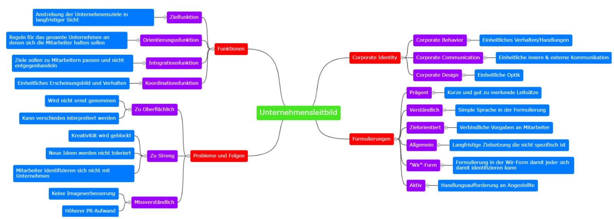

- Das Unternehmensleitbild bringt die Grundausrichtung der Unternehmung zum Ausdruck. Auf Basis des Unternehmensleitbildes werden konkrete Zielsetzungen definiert und in einem Zielsystem zueinander in Beziehung gesetzt.
- Die 4 Aspekte des Unternehmensleitbildes sind:
  1. [[Corporate Identity]] 
  2. [[Funktionen des Unternehmensleitbildes]] 
  3. [[Formulierung des Unternehmensleitbildes]] 
  4. [[Probleme und Folgen]]
- Mindmap zur schnellen Übersicht
  